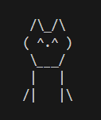

Chewie the Chihuahua

**About**

Chewie is a command line Chihuahua who struggles with anxiety.  Take her for a walk and successfully navigate the anxiety triggers she encounters, but be careful!  Every choice has consequences, some better than others.

**How to Play**
- This program is housed within a codebase of GitHub.  Within the repo, click the green "Code" button and select the active codebase
- This will open a VS Code web browser.  Navigate to the "TERMINAL" on the bottom half of your screen.
- In the terminal, type "python main.py" and press Enter
- It is recommended to adjust the size of your terminal window's height to see the full game screen
- Dark mode is available within the Settings gear icon in the botton left corner
- Screen prompts will ask you for a key based on how you want to respond (e.g. 'y' for yes, 'q' for quit)

**Features**
- Randomly generated triggers of Chewie's anxiety
- Randomly generated options for how to handle them
- Each trigger and response will fluctuate her anxiety and courage meters
- Each play will generate a random starting point of anxiety and courage

**Contact Info**
- http://linkedin.com/in/lorenhewins